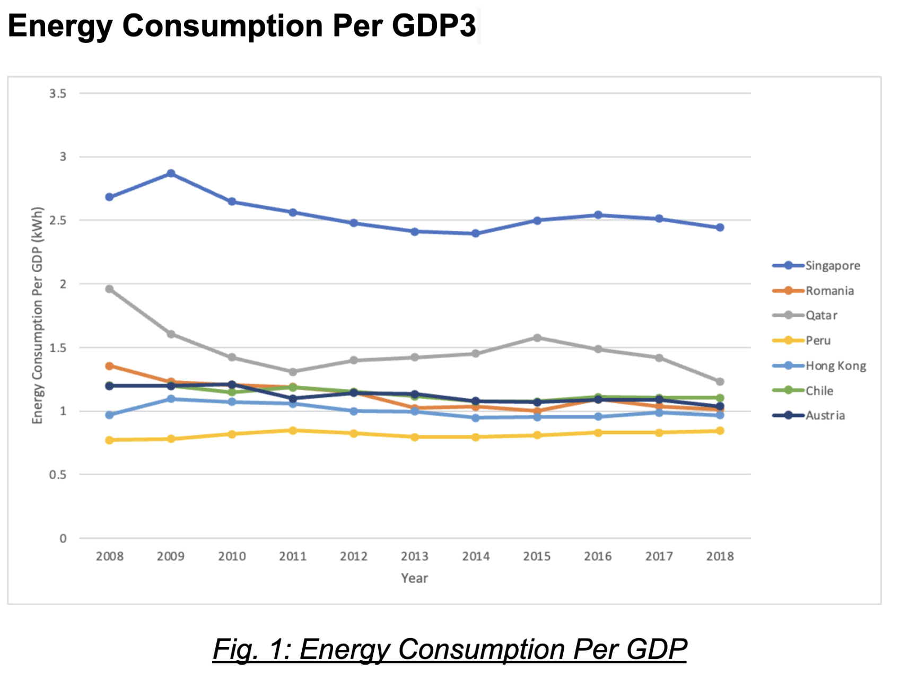
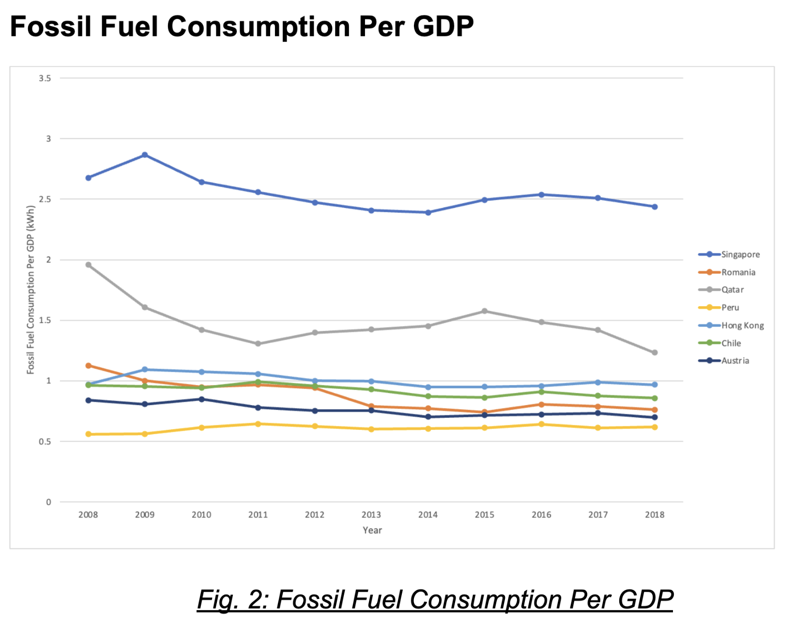
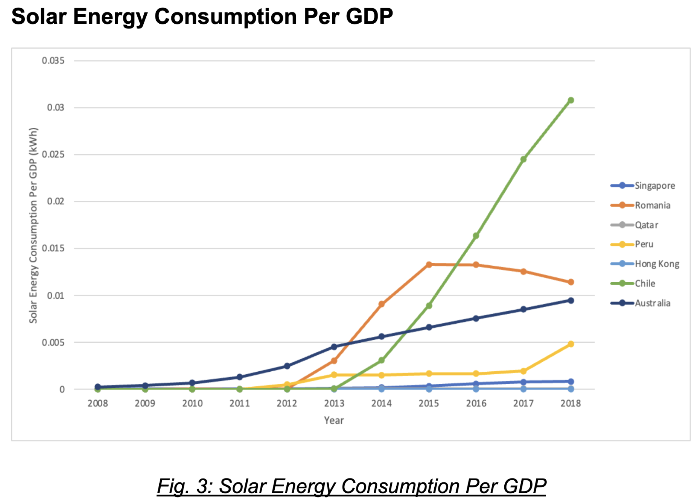
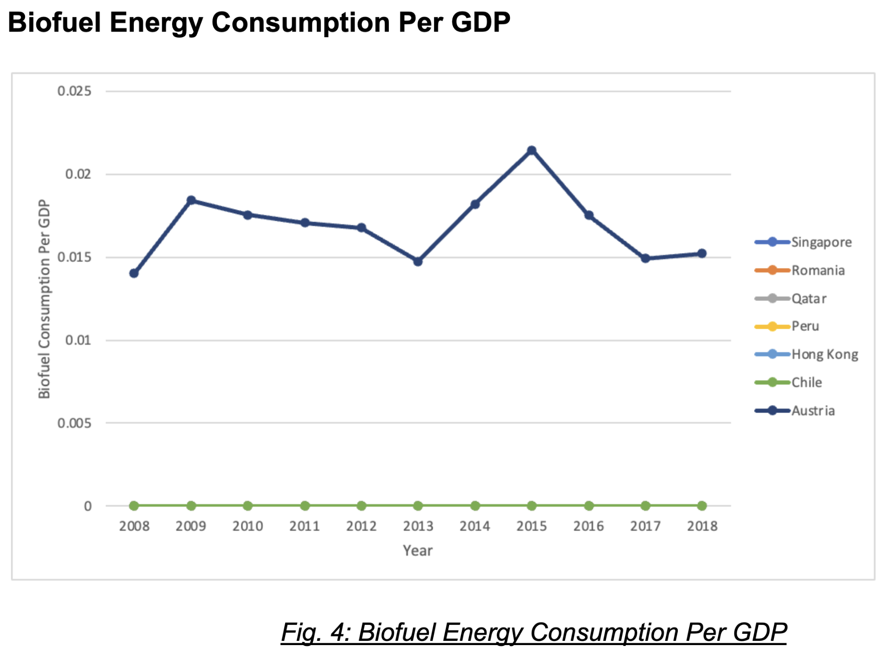

# SQL-Project

## Objective
In this project, the objective was to answer the following 2 questions:
1. What is the overall average import and export of each type of energy product in Singapore from 2005 - 2023?

2. How has Singapore been performing in terms of energy consumption?

## Dataset
We utilised 2 sources of data:
1. Data on Energy by Our World in Data  
   retrieved from https://github.com/owid/energy-data

2. Singapore Energy Consumption  
   retrieved from https://www.ema.gov.sg/singapore-energy-statistics/Ch03/index3

## Approach
There is a positive correlation between economic growth (measured by GDP) and the energy demands of an economy (Faisal, 2017). Hence, to ensure a fair comparison of Singapore's performance in terms of energy consumption, we selected countries with an average GDP that does not vary more than 10% from the average GDP of Singapore between 2008 - 2018. Based on the 10% threshold, we obtained the following 6 comparable references:

## Results

Singapore’s total energy consumption per GDP was the highest amongst the countries analysed. Given that the countries included in the analysis have a comparable GDP to Singapore, this could suggest that Singapore is not efficient in its energy usage.

Fossil fuel consumption consists of the consumption of coal, oil and gas. We can see from the graph that Singapore’s fossil fuel consumption per gdp is the highest, despite the slight decrease over the years. This is a point of concern as fossil fuels are non-renewable, hence a continued high reliance on fossil fuels is not sustainable. This is exacerbated by the fact that Singapore is reliant on other countries for its supply of fossil fuels and is thus vulnerable to price fluctuations such as the skyrocketing of oil prices during the Russia-Ukraine war. In addition, fossil fuels account for over 75% of global greenhouse gas emissions, which contributes to global warming (UN, n.d.).

## References
Faisal, F., Tursoy, T., & Ercantan, O. (2017). The relationship between energy consumption and economic growth: Evidence from non-Granger causality test. Procedia Computer Science, 120, 671–675. https://doi.org/10.1016/j.procs.2017.11.294 

United Nations. (n.d.). Causes and Effects of Climate Change. https://www.un.org/en/climatechange/science/causes-effects-climate-change
