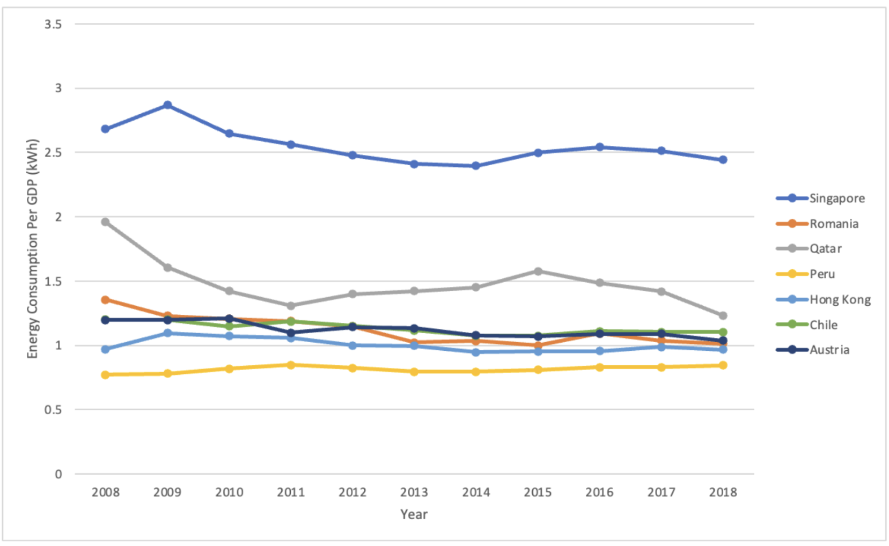

# SQL Project: Analysis of Singapore's Energy Consumption Performance

## Objective
In this project, our goal was to answer the following 2 questions:
1. What is the average import and export of each type of energy product in Singapore?

2. How has Singapore been performing in terms of energy consumption?

## Dataset
We utilised 2 sources of data:
1. Data on Energy by Our World in Data  
   retrieved from https://github.com/owid/energy-data

2. Singapore Energy Consumption  
   retrieved from https://www.ema.gov.sg/singapore-energy-statistics/Ch03/index3

## Approach
There is a positive correlation between economic growth (measured by GDP) and the energy demands of an economy (Faisal, 2017). Hence, to ensure a fair comparison of Singapore's performance in terms of energy consumption, we selected countries with an average GDP that does not vary more than 10% from the average GDP of Singapore between 2008 - 2018. Based on the 10% threshold, we obtained the following 6 comparable references:

Using MySQL, we queried the data to address the questions outlined above (refer to "Group Project.sql" file). 

The results were then transformed into visualisations in Excel below.

## Results
**Total Energy Consumption Comparison**

Singapore’s total energy consumption per GDP was consistently the highest among the countries analysed, which may indicate inefficiencies in energy usage. However, a more detailed breakdown by energy source is necessary before drawing any conclusions.

  

**Fossil Fuel Consumption Comparison**

Fossil fuel consumption includes coal, oil, and gas. Despite a slight decline over the years, Singapore's fossil fuel consumption per GDP remains the highest among the countries analyzed. This is concerning, as fossil fuels are non-renewable, making long-term reliance unsustainable. Moreover, Singapore's dependence on imported fossil fuels exposes it to supply chain disruptions and price volatility, such as the surge in oil prices during the Russia-Ukraine war. Additionally, fossil fuels contribute to over 75% of global greenhouse gas emissions, significantly driving global warming (UN, n.d.).

  

**Solar Energy Consumption Comparison**

Singapore has seen a growing adoption of solar energy in recent years. However, there remains significant potential for further expansion, as Singapore still has the second-lowest solar energy consumption among the nations analysed. With an average solar irradiance of 1,580 kWh/m² per year (EMA, 2021), Singapore is well-positioned to harness more solar power. Additionally, solar energy is less land-intensive than other energy sources, as solar panels can be installed on rooftops and even on buses, maximizing space efficiency.

  

**Biofuel Energy Consumption Comparison**

Singapore currently does not utilize biofuels, a form of energy derived from organic matter within a short time frame, such as ethanol and biodiesel. There is potential for Singapore to explore biofuels as an alternative energy source by replacing some of its existing fossil fuel plants with biofuel facilities that convert waste into energy products. This approach not only offers a sustainable energy solution but also addresses another pressing environmental issue: the growing amounts of waste generated daily. Singapore's only landfill, located on Semakau Island, is projected to run out of space by 2035.

## References
Faisal, F., Tursoy, T., & Ercantan, O. (2017). The relationship between energy consumption and economic growth: Evidence from non-Granger causality test. Procedia Computer Science, 120, 671–675. https://doi.org/10.1016/j.procs.2017.11.294 

United Nations. (n.d.). Causes and Effects of Climate Change. https://www.un.org/en/climatechange/science/causes-effects-climate-change

Energy Market Authority. (n.d.). What is the potential of solar energy in Singapore? https://www.ema.gov.sg/resources/faqs/energy-supply/solar/what-is-the-potential-of-solar-energy-in-singapore 
